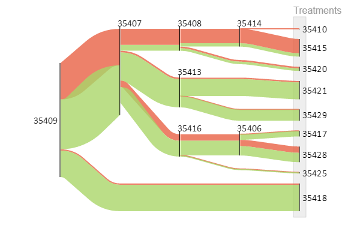

# Visualizing flow of patients in Oncoguide using Sankey diagrams
---
At [IKNL](<https://iknl.nl/>), we work everyday to continuously improve
oncological and palliative care of the Dutch population. We have developed
[Oncoguide](<https://www.iknl.nl/oncologische-zorg/oncoguide/>), a tool that
supports healthcare professionals and patients in making the best decisions
for their treatment. Oncoguide provides a graphical representation of clinical
guidelines for patient therapy in the shape of decision trees.

We wanted to generate a graphical representation of the flow of patients
through the decision trees. Namely, we were interested in seeing the amount of
patients that were treated according to the guidelines and the amount of
patients that were not. We used `floWeaver <https://github.com/ricklupton/floweaver>`_
to generate Sankey diagrams like the one shown below.

This is an example of a decision tree for prostate cancer. Each node of the
tree represents a decision point. Based on his (disease) characteristics,
the patient travels through the tree until he reaches a leaf, which
represents a (suggested) treatment. In green, you can see the patients that
were treated according to the guideline, while in red you can see the patients
that deviated from the guideline. This isn't necessarily bad (usually the
clinician has good reasons to do so), but it gives us a good idea of how
patients are treated.

Lastly, you can [`access Oncoguide here](<https://oncoguide.nl/>). It is
free of charge and creating an account is optional. Look for the English
version on the bottom of the main screen!
